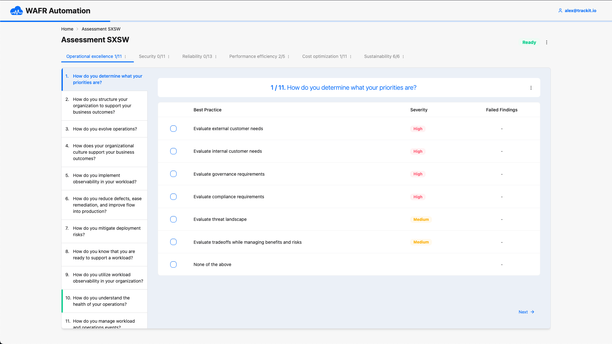

# Well-Architected Framework Review Automation Tool

<p align="center">
  <b>Well-Architected Framework Review Automation Tool</b> is a serverless application that automates the process of assessing the architecture of a given AWS account against the Well-Architected Framework.
</p>
<p align="center">
  <b>Learn more in this <a href="https://trackit.io/aws-wafr-automation/">blog post</a></b>
</p>
<hr>

<p align="center">
  <a href="https://github.com/trackit/wafr-automation-tool/actions/workflows/tests.yml">
    
  </a>
  <a href="https://github.com/trackit/wafr-automation-tool/actions/workflows/linting-code-formatting.yml">
    
  </a>
  <a href="https://github.com/trackit/wafr-automation-tool/blob/main/LICENSE">
    
  </a>
  <a href="https://github.com/trackit/wafr-automation-tool/releases">
    
  </a>
  <a href="https://trackit.io/aws-wafr-automation/">
    
  </a>
</p>

<hr>



## Table of contents

- [Overview](#overview)
  - [Architecture](#architecture)
- [Getting started](#getting-started)
  - [Requirements](#requirements)
  - [Backend](#backend)
  - [Frontend](#frontend)
- [Deployment](#deployment)
  - [Build](#build)
  - [Deploy](#deploy)

## Overview

This tool is designed to be used by AWS Well-Architected Reviewer to assess the architecture of an AWS account against the Well-Architected Framework.

### Architecture

The WAFR Automation Tool uses a serverless architecture built on AWS services:

- Built using AWS Serverless Application Model (SAM)
- Runs as a collection of serverless functions that automatically assess AWS accounts
- Performs automated checks against Well-Architected Framework principles
- Scales automatically based on demand
- Operates with a pay-per-use cost model


## Getting started

### Backend

More information about the backend can be found in the Backend [README](./backend/README.md).

### Frontend

More information about the frontend can be found in the Frontend [README](./webui/README.md).

## Deployment

### Requirements

- [Docker >= 19.03](https://docs.docker.com/get-docker/)
  - the Docker daemon must also be running
- [AWS SAM CLI >= 1.134.0](https://docs.aws.amazon.com/serverless-application-model/latest/developerguide/install-sam-cli.html#install-sam-cli-instructions)

### Build

To build the serverless application, using [SAM](https://docs.aws.amazon.com/serverless-application-model/latest/developerguide/serverless-sam-cli-using-build.html) run:

```bash
sam build --use-container --mount-symlinks
```

### Deploy

With [SAM](https://docs.aws.amazon.com/serverless-application-model/latest/developerguide/serverless-deploying.html#serverless-sam-cli-using-package-and-deploy), run:

```bash
sam deploy --config-env <dev|prod>
```

# License

Copyright 2025 TrackIt

Licensed under the Apache License, Version 2.0 (the "License");
you may not use this file except in compliance with the License.
You may obtain a copy of the License at

  [LICENSE](./LICENSE)

Unless required by applicable law or agreed to in writing, software
distributed under the License is distributed on an "AS IS" BASIS,
WITHOUT WARRANTIES OR CONDITIONS OF ANY KIND, either express or implied.
See the License for the specific language governing permissions and
limitations under the License.
