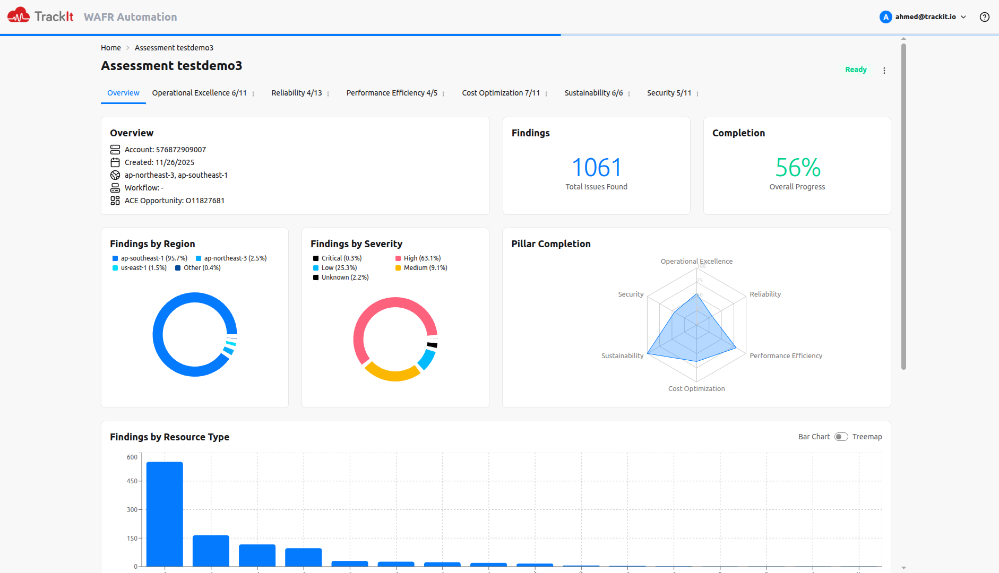
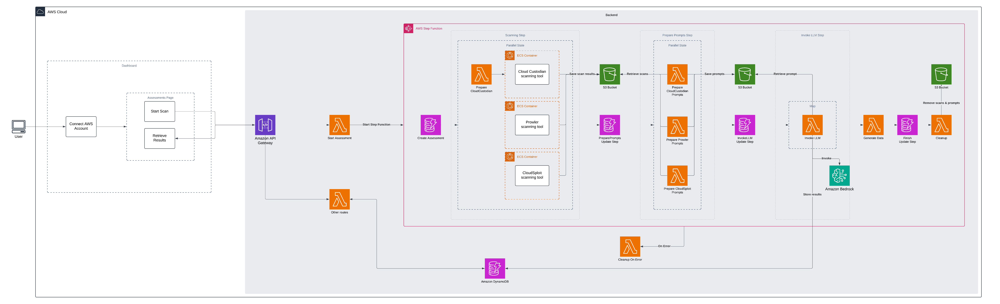

<h1 align="center">Well-Architected Framework Review Automation Tool</h1>

<p align="center">
  <b>Well-Architected Framework Review Automation Tool</b> is a serverless application that automates the process of assessing the architecture of a given AWS account against the Well-Architected Framework.
</p>
<p align="center">
  <b>Learn more in this <a href="https://trackit.io/aws-wafr-automation/">blog post</a></b>
</p>

<hr>

<p align="center">
  <a href="https://github.com/trackit/wafr-automation-tool/actions/workflows/tests.yml"></a>
  <a href="https://github.com/trackit/wafr-automation-tool/actions/workflows/linting-code-formatting.yml"></a>
  <a href="https://github.com/trackit/wafr-automation-tool/blob/main/LICENSE"></a>
  <a href="https://github.com/trackit/wafr-automation-tool/releases"></a>
  <a href="https://trackit.io/aws-wafr-automation/"></a>
</p>

<hr>



## Table of contents

- [Overview](#overview)
  - [Architecture](#architecture)
- [Getting started](#getting-started)
  - [Prerequisites](#prerequisites)
  - [Dependencies Installation](#dependencies-installation)
  - [Backend](#backend)
  - [Frontend](#frontend)
- [Contributing](#contributing)
- [License](#license)
- [Contact](#contact)

## Overview

The **WAFR Automation Tool** is designed to automate the assessment of AWS architectures against the Well-Architected Framework.
It targets cloud architects and DevOps teams aiming to enhance quality, security, and performance of their AWS environments.

### Architecture

This project leverages a scalable serverless architecture using AWS technologies:

- Built using AWS Serverless Application Model (SAM)
- Runs as a collection of serverless functions that automatically assess AWS accounts
- Performs automated checks against Well-Architected Framework principles
- Automatic scaling with a pay-per-use cost model



## Getting started

### Prerequisites

- [Docker >= 19.03](https://docs.docker.com/get-docker/)
  - the Docker daemon must also be running
- [AWS SAM CLI >= 1.134.0](https://docs.aws.amazon.com/serverless-application-model/latest/developerguide/install-sam-cli.html#install-sam-cli-instructions)
- [Node.js >= 22.x](https://nodejs.org/en/download/)

### Dependencies Installation

From the project root directory, run:

```shell
$ npm install
```

### Backend

More information about the backend can be found in the Backend [README](./apps/backend/README.md).

### Frontend

More information about the frontend can be found in the Frontend [README](./apps/webui/README.md).

# Contributing

Contributions of any kind are welcome to help improve this project.

Please read our [contributing guidelines](./CONTRIBUTING.md) guidelines before submitting a pull request or issue.

# License

Copyright 2025 TrackIt

Licensed under the Apache License, Version 2.0 (the "License");
you may not use this file except in compliance with the License.
You may obtain a copy of the License at

[LICENSE](./LICENSE)

Unless required by applicable law or agreed to in writing, software
distributed under the License is distributed on an "AS IS" BASIS,
WITHOUT WARRANTIES OR CONDITIONS OF ANY KIND, either express or implied.
See the License for the specific language governing permissions and
limitations under the License.

# Contact

For questions, suggestions, or support, please open an issue on GitHub or contact us via the blog.
